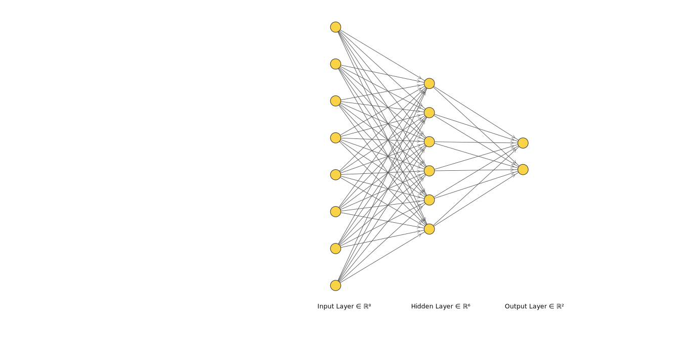

# Soft Computing Assignment 3

This Project was done by Balaji Jayashrri (106118019) and S Pavithra (106118091).

## Implementing Neural Network in Matlab
A neural network was trained on the *Pima Diabetes Dataset* wherein the task was to classify a person as *diabetic or not-diabetic* based on the following factors: 
- Number of pregnancies a person has had
- Glucose Level
- Blood Pressure
- Skin Thickness
- Insulin
- BMI
- Age
- Diabetic Pedigree. 

### Model
The structure of the network is as follows:

The two output units stand for diabetic and non-diabetic respectively. The probability of each class is predicted at the output layer using *sigmoid activation*. Output predicted is the one with the greater probability. Since, this is a binary classification problem, *binary cross entropy* loss was used to compute error. 
- Epochs trained: 30
- Training Accuracy: ~75% 
- Test Accuracy: ~75%

## Implementing Genetic Algorithm in Matlab
A model using Multiple Linear Regression was built on the Red Wine Quality dataset, which determines the quality of a wine sample *on a scale of 0 to 10* based on the following factors: 
- Fixed Aciditiy
- Volatile Acidity
- Citric Acid
- Residual Sugar
- Chlorides
- Free Sulphur Dioxide
- Total Sulphur Dioxide
- Density
- pH
- Sulphates
- Alcohol

The optimum parameters of the objective function was obtained using Genetic Algorithm, run with the following options on the mean squared error cost function.
- Maximum Generations: 300 
- Maximum Stall Generations: 100
- Selection Function: Stochastic Universal Sampling
- Crossover Function: Arithmetic Crossover
- Mutation Function: Gaussian Mutation

The output was obtained as follows.
- Training Error: ~0.5
- Test Error: ~0.4